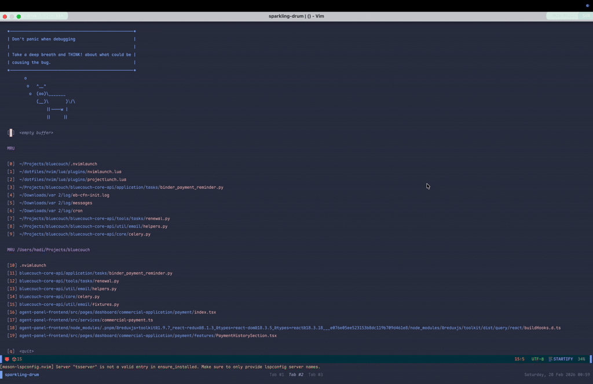

# nvimlaunch

A Neovim plugin for launching and managing project shell commands from a per-project `.nvimlaunch` config file. Run long-lived processes (dev servers, build watchers, test runners), view their live output, and stop or restart them — all without leaving your editor.



## Features

- Reads commands from a `.nvimlaunch` JSON file in your project root
- Groups commands by label for easy organisation
- Shows live status: `RUNNING`, `STOPPED`, `EXITED`, `FAILED`
- Per-command output buffer with auto-scroll and automatic line-limit trimming
- Start, stop, and restart individual commands, entire groups, or all at once
- Auto-start commands when the panel opens
- Per-command working directory and environment variables
- Live uptime and exit code display in the panel
- Notifications on unexpected command failures
- Optional file logging for persistent output history
- Fully configurable keymaps
- Reload config without restarting Neovim
- Automatic cleanup of all jobs when Neovim exits
- Status refreshes every 500 ms automatically

## Requirements

- Neovim 0.9+
- `bash` available in `$PATH`

## Installation

### lazy.nvim

```lua
{
  "hadishahpuri/nvimlaunch",
  keys = {
    { "<leader>l", "<cmd>NvimLaunch<cr>", desc = "NvimLaunch" },
  },
},
```

To customise options:

```lua
{
  "hadishahpuri/nvimlaunch",
  opts = {
    max_lines    = 5000,  -- max lines kept per output buffer (default: 5000)
    log_to_file  = true,  -- write output to .nvimlaunch-logs/ (default: false)
    keymaps = {           -- override any default keymap (optional)
      stop = "x",
    },
  },
  keys = {
    { "<leader>l", "<cmd>NvimLaunch<cr>", desc = "NvimLaunch" },
  },
},
```

### packer.nvim

```lua
use "hadishahpuri/nvimlaunch"
```

Then call setup manually somewhere in your config:

```lua
require("nvimlaunch").setup()
```

## Configuration

Create a `.nvimlaunch` file in the root of your project:

```json
{
  "commands": [
    {
      "name": "Start Dev Server",
      "cmd": "pnpm dev",
      "groups": ["Frontend"],
      "cwd": "./frontend",
      "auto_start": true
    },
    {
      "name": "Build",
      "cmd": "pnpm build",
      "groups": ["Frontend"]
    },
    {
      "name": "API Server",
      "cmd": "python manage.py runserver",
      "groups": ["Backend"],
      "cwd": "./backend",
      "env": { "DJANGO_DEBUG": "1", "PORT": "8000" },
      "auto_start": true
    },
    {
      "name": "Celery Worker",
      "cmd": "./venv/bin/celery -A core worker -l INFO",
      "groups": ["Backend"],
      "cwd": "./backend"
    }
  ]
}
```

| Field        | Type                    | Required | Description                                                        |
|--------------|-------------------------|----------|--------------------------------------------------------------------|
| `name`       | `string`                | yes      | Display name shown in the panel                                    |
| `cmd`        | `string`                | yes      | Shell command — runs via `bash -c`                                 |
| `groups`     | `string[]`              | no       | One or more group labels for organising commands (default: `["Default"]`) |
| `cwd`        | `string`                | no       | Working directory — relative paths resolve from the `.nvimlaunch` file |
| `env`        | `object`                | no       | Environment variables to set for this command                      |
| `auto_start` | `boolean`               | no       | Start automatically when the panel opens (default: `false`)        |

A command listed under multiple groups appears under each group in the panel.

## Setup options

| Option        | Type      | Default               | Description                                      |
|---------------|-----------|-----------------------|--------------------------------------------------|
| `max_lines`   | `number`  | `5000`                | Max lines kept per output buffer                 |
| `log_to_file` | `boolean` | `false`               | Write all output to `.nvimlaunch-logs/` directory |
| `log_dir`     | `string`  | `.nvimlaunch-logs/`   | Custom log directory (when `log_to_file` is true) |
| `keymaps`     | `table`   | see below             | Override default keybindings                     |

### Keymap defaults

```lua
require("nvimlaunch").setup({
  keymaps = {
    run_restart  = "<cr>",      -- run or restart selected command
    stop         = "s",         -- stop selected command
    output       = "o",         -- open output window
    start_all    = "a",         -- start all commands
    start_group  = "g",         -- start all commands in current group
    reload       = "r",         -- reload .nvimlaunch config
    close        = { "q", "<Esc>" },  -- close panel
    output_close = "q",         -- close output window
    output_clear = "c",         -- clear output buffer
  },
})
```

## Usage

### Commands

| Command              | Description                          |
|----------------------|--------------------------------------|
| `:NvimLaunch`        | Open the command panel               |
| `:NvimLaunchStopAll` | Stop all currently running commands  |

### Panel keymaps

| Key           | Action                                               |
|---------------|------------------------------------------------------|
| `j` / `↓`     | Move to next command                                 |
| `k` / `↑`     | Move to previous command                             |
| `<cr>`        | **Run** selected command (or **Restart** if running) |
| `s`           | **Stop** selected command                            |
| `o`           | Open **output** window for selected command          |
| `a`           | **Start all** non-running commands                   |
| `g`           | **Start group** — start all commands in current group|
| `r`           | **Reload** `.nvimlaunch` config from disk            |
| `q` / `<Esc>` | Close panel                                          |

### Output window keymaps

| Key | Action                              |
|-----|-------------------------------------|
| `q` | Close output and return to panel    |
| `c` | Clear the output buffer             |

## How it works

```
project/
├── .nvimlaunch           ← per-project config, not checked in (add to .gitignore)
└── .nvimlaunch-logs/     ← output logs (when log_to_file is enabled)
```

Each command runs as a background job via Neovim's `jobstart`. Its stdout and stderr are streamed into a dedicated buffer that persists for the lifetime of the Neovim session. Restarting a command appends a separator to the existing buffer rather than clearing it, so you keep the full history.

Output buffers are capped at `max_lines` (default 5000). When the limit is reached, the oldest lines are automatically dropped so memory use stays bounded even for commands that produce continuous output.

When `log_to_file` is enabled, all output is also written to `.nvimlaunch-logs/<command-name>.log` next to your `.nvimlaunch` config file, so you can review logs after restarting Neovim.

The panel floats in the centre of the screen and polls job status every 500 ms. Running commands show their uptime, and failed commands show their exit code:

```
╭────────────────────────────── NvimLaunch ──────────────────────────────╮
│                                                                        │
│  Frontend                                                              │
│  ●  Start Dev Server                          2m30s  [RUNNING]         │
│  ○  Build                                            [STOPPED]         │
│                                                                        │
│  Backend                                                               │
│  ●  API Server                                1m15s  [RUNNING]         │
│  ✗  Celery Worker                           exit(1)  [FAILED ]         │
│                                                                        │
│  <cr> Run  s Stop  o Out  a All  g Grp  r Reload  q Quit              │
╰────────────────────────────────────────────────────────────────────────╯
```

All running jobs are automatically stopped when Neovim exits, so there is no need for manual cleanup.

## Tips

- Add `.nvimlaunch` and `.nvimlaunch-logs/` to your global `.gitignore` if commands contain machine-specific paths, or commit `.nvimlaunch` if your team shares the same setup.
- Use `auto_start` on commands you always need (e.g. dev servers) so they launch as soon as you open the panel.
- Use `cwd` instead of `cd ... &&` prefixes in your commands for cleaner config.
- Press `a` to spin up your entire dev environment in one keystroke.

## License

MIT
